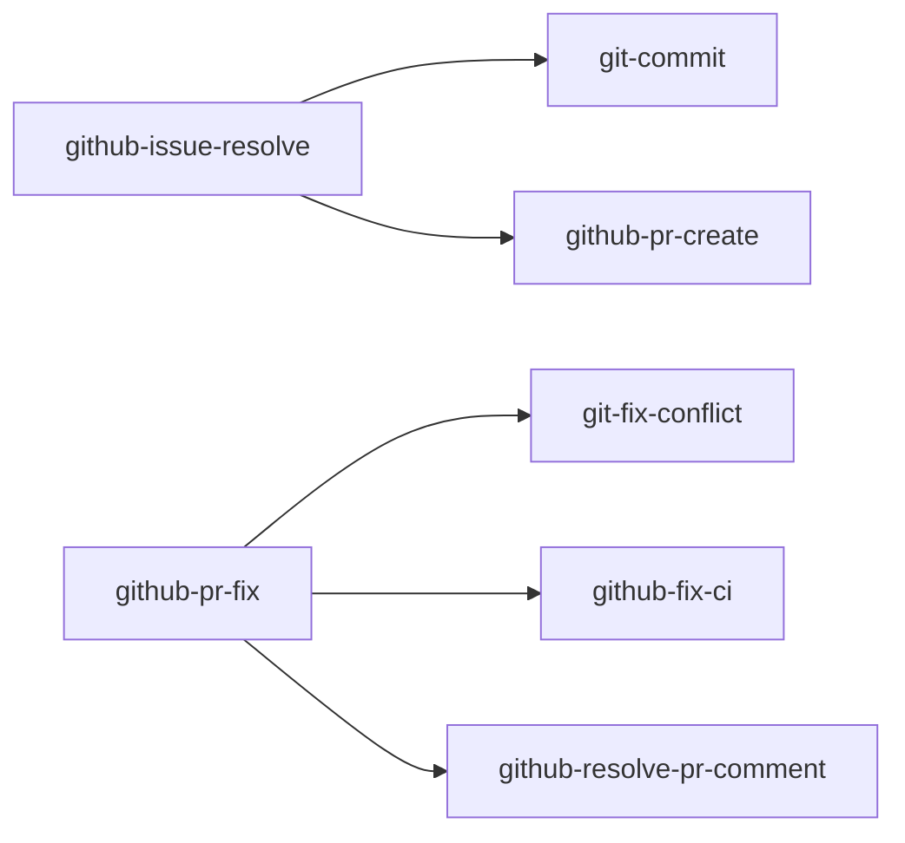

# skills

My [Agent Skills](https://agentskills.io).

## Skills

### git / github

| skill                                                                | Description                                                                                            |
| -------------------------------------------------------------------- | ------------------------------------------------------------------------------------------------------ |
| [git-commit](skills/git/git-commit)                                  | Review the current changes and commit them in Conventional Commits format                              |
| [git-fix-conflict](skills/git/git-fix-conflict)                      | Detect and resolve conflicts from merge, rebase, cherry-pick, and more                                 |
| [github-fix-ci](skills/github/github-fix-ci)                         | Analyze CI failures and fix them automatically                                                         |
| [github-issue-create](skills/github/github-issue-create)             | Verify the claims in the draft and search related issues, then create one GitHub Issue                 |
| [github-issue-polish](skills/github/github-issue-polish)             | Polish a GitHub issue until it can be implemented from the issue alone                                 |
| [github-issue-resolve](skills/github/github-issue-resolve)           | Run investigation → worktree creation → implementation → PR creation end-to-end from an issue          |
| [github-issue-update](skills/github/github-issue-update)             | Review open issues across the board and apply close / follow-up / label changes in bulk after approval |
| [github-pr-create](skills/github/github-pr-create)                   | Create a Pull Request from the current branch                                                          |
| [github-pr-fix](skills/github/github-pr-fix)                         | Detect all PR problems (conflicts, CI failures, review comments) and fix them in a git worktree        |
| [github-pr-review](skills/github/github-pr-review)                   | Review a PR with Finder/Verifier subagents and post a report and inline comments                       |
| [github-resolve-pr-comment](skills/github/github-resolve-pr-comment) | Check PR review comments, address them, and reply                                                      |

### delegation

| skill                                                      | Description                                                                     |
| ---------------------------------------------------------- | ------------------------------------------------------------------------------- |
| [claude](skills/delegation/claude)                         | Call the Claude Code CLI non-interactively for consultation or delegated work   |
| [codex](skills/delegation/codex)                           | Call the Codex CLI non-interactively for consultation or delegated work         |
| [resume-other-agent](skills/delegation/resume-other-agent) | Restore another coding agent's previous work from its session log and resume it |

### planning

| skill                                              | Description                                                                                                     |
| -------------------------------------------------- | --------------------------------------------------------------------------------------------------------------- |
| [experiment-plan](skills/planning/experiment-plan) | Refine a machine learning experiment plan through dialogue and save it                                          |
| [grill-me](skills/planning/grill-me)               | Keep questioning the user until every decision point in a plan or design is resolved                            |
| [grill-self](skills/planning/grill-self)           | Resolve every decision point through the agent's own research and self-questioning, then present a decision log |

### review

| skill                                      | Description                                                                             |
| ------------------------------------------ | --------------------------------------------------------------------------------------- |
| [skill-review](skills/review/skill-review) | Score the quality of an agent skill (SKILL.md) and report findings with suggested fixes |

### research

| skill                                          | Description                                                                                                           |
| ---------------------------------------------- | --------------------------------------------------------------------------------------------------------------------- |
| [deep-research](skills/research/deep-research) | Deep-research a topic with web search, present a cited Markdown note, and save it in the current directory on request |

### writing

| skill                                                         | Description                                                              |
| ------------------------------------------------------------- | ------------------------------------------------------------------------ |
| [japanese-tech-writing](skills/writing/japanese-tech-writing) | Writing guidelines for Japanese technical documents and book manuscripts |
| [stop-ai-slop-jp](skills/writing/stop-ai-slop-jp)             | Rewrite AI-generated Japanese into natural, readable prose               |

### docs

| skill                            | Description                                                                                          |
| -------------------------------- | ---------------------------------------------------------------------------------------------------- |
| [doc-sync](skills/docs/doc-sync) | Detect and fix drift between documentation and the implementation                                    |
| [md-note](skills/docs/md-note)   | Summarize research and discussion from the current conversation into a single Japanese Markdown file |

### tools

| skill                                           | Description                                                |
| ----------------------------------------------- | ---------------------------------------------------------- |
| [wezterm-control](skills/tools/wezterm-control) | Control wezterm panes, tabs, and windows via `wezterm cli` |

### Skill's Dependencies



### Agents

The github-pr-review skill uses three reviewer agents defined in [agents/](agents/): `code-reviewer-finder`, `code-reviewer-standards`, and `code-reviewer-verifier`. Agents ship through the Claude Code plugin and through apm; with `apm install -t codex` they are converted to Codex agent format (the `tools` restriction is dropped in conversion). On other install methods the skill falls back to generic subagents given the same prompts.

## Installation

- plugin: register mjun0812/skills as a plugin repository and install skills through it.
- npx skills / gh skills / apm: copy only the skills you want as plain files

See [docs/skill-distribution-comparison.md](docs/skill-distribution-comparison.md) for a detailed comparison of the five install methods.

### Claude Code plugin

```bash
# in session
/plugin marketplace add mjun0812/skills
/plugin install mjun-skills@mjun
# cli
claude plugin marketplace add mjun0812/skills
claude plugin install mjun-skills@mjun
# update
claude plugin update mjun-skills@mjun
```

### Codex plugin

```bash
codex plugin marketplace add mjun0812/skills
codex plugin add mjun-skills
codex plugin marketplace upgrade mjun
codex plugin remove mjun-skills
```

### npx skills

```bash
# Select skills and target agents interactively
npx skills add mjun0812/skills

# Install all skills
npx skills add mjun0812/skills --all
# Install specific skills
npx skills add mjun0812/skills --skill git-commit --skill github-pr-create
npx skills add mjun0812/skills --skill git-commit -a claude-code -y

# Install to the user global scope instead of the project
npx skills add mjun0812/skills --skill git-commit -g

# Update (uses skills-lock.json)
npx skills update
```

### gh skill

```bash
gh skill install mjun0812/skills

# Install all skills
gh skill install mjun0812/skills --all
# Install a specific skill with target agent and scope
gh skill install mjun0812/skills git-commit --agent claude-code --scope user
gh skill install mjun0812/skills git-commit --agent codex --scope project

# Pin to a git tag
gh skill install mjun0812/skills git-commit@v1.0.0

# Update
gh skill update
```

### [apm](https://github.com/microsoft/apm)

```bash
# Install all skills
apm install mjun0812/skills

# Install specific skills (persisted to apm.yml / apm.lock.yaml)
apm install mjun0812/skills --skill git-commit

# Specify target harnesses
apm install mjun0812/skills -t claude,codex

# Pin to a git tag
apm install mjun0812/skills#v1.0.0

# Update
apm update
```

### Removed skills

How a skill removed from this repo is handled depends on the install method.

| Method                     | Behavior                                                                          |
| -------------------------- | --------------------------------------------------------------------------------- |
| Claude Code / Codex plugin | Removed automatically on update (the whole bundle is replaced)                    |
| apm                        | Removed automatically on update (cleaned up as stale files based on the lockfile) |
| npx skills / gh skill      | Local copies remain; delete them manually                                         |

## Release

Releases are cut with the mise task:

```bash
mise run release 0.2.0
```

It syncs the version into `.claude-plugin/plugin.json` and `.codex-plugin/plugin.json`, commits, tags `v0.2.0`, and pushes. The tag push triggers [release.yml](.github/workflows/release.yml), which verifies that the tag matches the manifest versions and creates a GitHub Release with auto-generated notes.
