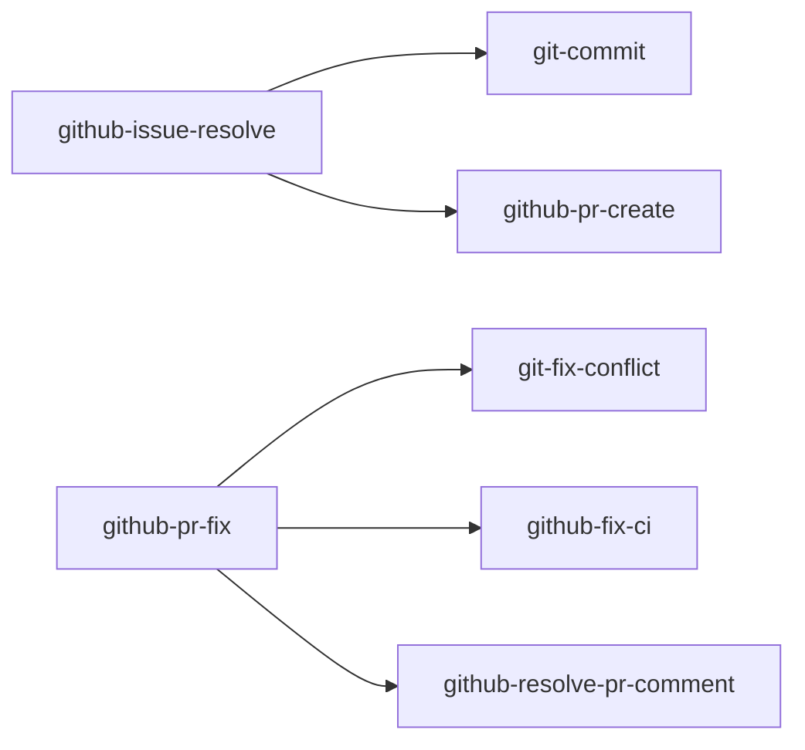

# skills

My [Agent Skills](https://agentskills.io).

## Skills

### git / github

| skill                                                                | 説明                                                                                       |
| -------------------------------------------------------------------- | ------------------------------------------------------------------------------------------ |
| [git-commit](skills/git/git-commit)                                  | 現在の変更を確認してConventional Commits形式でコミットする                                 |
| [git-fix-conflict](skills/git/git-fix-conflict)                      | merge・rebase・cherry-pickなどで発生したコンフリクトを検出して解消する                     |
| [github-fix-ci](skills/github/github-fix-ci)                         | CIの失敗を分析して自動修正する                                                             |
| [github-issue-create](skills/github/github-issue-create)             | ユーザーから情報を収集してGitHub Issueを作成する                                           |
| [github-issue-polish](skills/github/github-issue-polish)             | GitHub issueを「issueだけで実装できる」状態まで磨き上げる                                  |
| [github-issue-resolve](skills/github/github-issue-resolve)           | issueを起点に「調査 → worktree作成 → 実装 → PR作成」を一気通貫で実行する                   |
| [github-issue-update](skills/github/github-issue-update)             | open issueを横断的に点検し、close・追記・ラベル変更を承認の上で一括反映する                |
| [github-pr-create](skills/github/github-pr-create)                   | 現在のbranchからPull Requestを作成する                                                     |
| [github-pr-fix](skills/github/github-pr-fix)                         | PRの全問題 (コンフリクト、CI失敗、レビューコメント) を検出してworktree内で修正する         |
| [github-pr-review](skills/github/github-pr-review)                   | Finder/Verifier SubAgentでPRのコードレビューを行い、レポートとインラインコメントを投稿する |
| [github-resolve-pr-comment](skills/github/github-resolve-pr-comment) | PRのレビューコメントを確認し、対応・返信する                                               |

### delegation

| skill                                                      | 説明                                                                    |
| ---------------------------------------------------------- | ----------------------------------------------------------------------- |
| [claude](skills/delegation/claude)                         | Claude Code CLIを非対話モードで呼び出し、相談または作業委譲の結果を得る |
| [codex](skills/delegation/codex)                           | Codex CLIを非対話モードで呼び出し、相談または作業委譲の結果を得る       |
| [resume-other-agent](skills/delegation/resume-other-agent) | 別のcoding agentのsession logから直前作業を復元してresumeする           |

### planning

| skill                                              | 説明                                                                      |
| -------------------------------------------------- | ------------------------------------------------------------------------- |
| [experiment-plan](skills/planning/experiment-plan) | 機械学習の実験計画を対話で詰めて保存する                                  |
| [grill-me](skills/planning/grill-me)               | 計画・設計の分岐点が解消されるまでユーザーへ質問を繰り返す                |
| [grill-self](skills/planning/grill-self)           | 計画・設計の分岐点をagentが調査と自己問答で解消し、意思決定ログを提示する |

### review

| skill                                      | 説明                                                        |
| ------------------------------------------ | ----------------------------------------------------------- |
| [skill-review](skills/review/skill-review) | Agent skill (SKILL.md) の品質を採点し、修正案をレポートする |

### writing

| skill                                                               | 説明                                             |
| ------------------------------------------------------------------- | ------------------------------------------------ |
| [cognitive-rhythm-writing](skills/writing/cognitive-rhythm-writing) | 説明的な文章に緩急を設計するための規範           |
| [japanese-tech-writing](skills/writing/japanese-tech-writing)       | 日本語の技術文書・書籍原稿の文章規範             |
| [stop-ai-slop-jp](skills/writing/stop-ai-slop-jp)                   | AIで書いた日本語を自然で読みやすい文章に書き直す |

### docs

| skill                            | 説明                                                          |
| -------------------------------- | ------------------------------------------------------------- |
| [doc-sync](skills/docs/doc-sync) | ドキュメントと実装の乖離を検出して更新する                    |
| [md-note](skills/docs/md-note)   | 会話で調査・検討した内容を日本語のMarkdown1ファイルにまとめる |

### tools

| skill                                           | 説明                                                  |
| ----------------------------------------------- | ----------------------------------------------------- |
| [wezterm-control](skills/tools/wezterm-control) | weztermのpane・tab・windowを `wezterm cli` で操作する |

### Skill's Dependencies



### Agents

github-pr-review skillは、[agents/](agents/) に定義された3つのレビュー用agent (`code-reviewer-finder`、`code-reviewer-standards`、`code-reviewer-verifier`) を使う。agentはClaude Code plugin経路でのみ配布される。他の経路でinstallした場合、skillは同じpromptを汎用のSubAgentへ渡して代替する。

## Installation

- plugin: mjun0812/skillをrepositoryとして扱い、skillを選択してinstallする。
- npx skills / gh skills / apm: 欲しいskillだけを選んでファイルとしてコピーする

### Claude Code plugin

```bash
# in session
/plugin marketplace add mjun0812/skills
/plugin install mjun-skills@mjun
# cli
claude plugin marketplace add mjun0812/skills
claude plugin install mjun-skills@mjun
# update
claude plugin update mjun-skills@mjun
```

### Codex plugin

```bash
codex plugin marketplace add mjun0812/skills
codex plugin add mjun-skills
codex plugin marketplace upgrade mjun
codex plugin remove mjun-skills
```

### npx skills

```bash
# Select skills and target agents interactively
npx skills add mjun0812/skills

# Install all skills
npx skills add mjun0812/skills --all
# Install specific skills
npx skills add mjun0812/skills --skill git-commit --skill github-pr-create
npx skills add mjun0812/skills --skill git-commit -a claude-code -y

# Install to the user global scope instead of the project
npx skills add mjun0812/skills --skill git-commit -g

# Update (uses skills-lock.json)
npx skills update
```

### gh skill

```bash
gh skill install mjun0812/skills

# Install all skills
gh skill install mjun0812/skills --all
# Install a specific skill with target agent and scope
gh skill install mjun0812/skills git-commit --agent claude-code --scope user
gh skill install mjun0812/skills git-commit --agent codex --scope project

# Pin to a git tag
gh skill install mjun0812/skills git-commit@v1.0.0

# Update
gh skill update
```

### [apm](https://github.com/microsoft/apm)

```bash
# Install all skills
apm install mjun0812/skills

# Install specific skills (persisted to apm.yml / apm.lock.yaml)
apm install mjun0812/skills --skill git-commit

# Specify target harnesses
apm install mjun0812/skills -t claude,codex

# Pin to a git tag
apm install mjun0812/skills#v1.0.0

# Update
apm update
```

### 廃止されたskillの扱い

このrepoから削除されたskillの扱いは、install経路によって異なる。

| 経路                       | 挙動                                                                |
| -------------------------- | ------------------------------------------------------------------- |
| Claude Code / Codex plugin | 更新時に自動で削除される (バンドル全体が置き換わるため)             |
| apm                        | 更新時に自動で削除される (lockfileを基にstale fileとして掃除される) |
| npx skills / gh skill      | ローカルコピーが残るため、手動で削除する                            |

## Release

リリースはmise taskで行う。

```bash
mise run release 0.2.0
```

`.claude-plugin/plugin.json` と `.codex-plugin/plugin.json` へversionをsyncしてcommitし、`v0.2.0` タグを作成してpushする。tagのpushで [release.yml](.github/workflows/release.yml) が起動し、tagとmanifestのversion一致を検証した上でGitHub Releaseを自動作成する。
