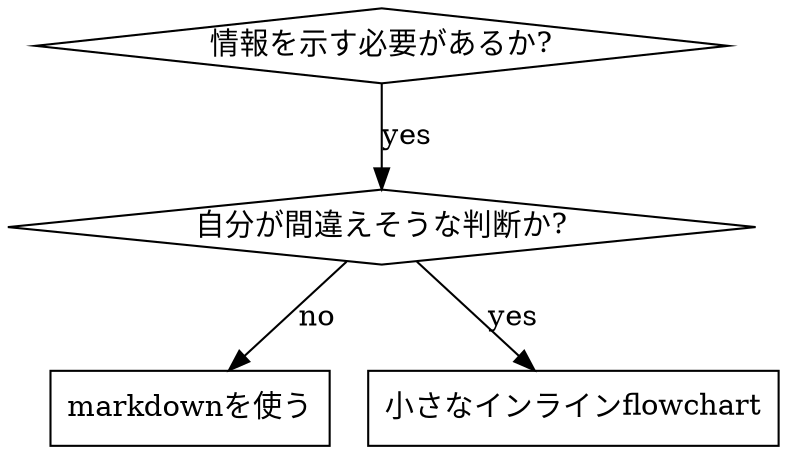

# Writing Skills

## 概要

**skillの作成は、プロセス文書にテスト駆動開発を適用したものだ。**

**個人用のskillは、実行環境のskillsディレクトリに置く** (Claude Codeでは `~/.claude/skills/`)。Codex、Copilot CLI、Gemini CLIは、実行環境をまたぐ別名として `~/.agents/skills/` も認識する。

テストケース(subagentによるプレッシャーシナリオ)を書き、失敗する様子(baselineの挙動)を観察し、skill(文書)を書き、テストが通る様子(agentが従う)を観察し、refactorする(抜け道を塞ぐ)。

**中心原則:** skillなしでagentが失敗する様子を観察していなければ、そのskillが正しい内容を教えているかどうかは分からない。

**必須の前提知識:** このskillを使う前に、[references/test-driven-development.md](references/test-driven-development.md) を必ず理解すること。この文書は基本となるRED-GREEN-REFACTORサイクルを定義している。このskillはTDDを文書に適用したものだ。

**公式ガイダンス:** Anthropicによるskill作成のベストプラクティスは [references/anthropic-best-practices.md](references/anthropic-best-practices.md) を参照すること。この文書は、このskillのTDD中心のアプローチを補う追加のパターンとガイドラインを示す。

## skillとは

**skill**は、実績のある技法・パターン・ツールのリファレンスガイドだ。将来のagentが有効なアプローチを見つけて適用するのを助ける。

**skillであるもの:** 再利用できる技法、パターン、ツール、リファレンスガイド

**skillでないもの:** 一度問題をどう解決したかの物語

## skillに対するTDDの対応

| TDDの概念              | skillの作成                                   |
| ---------------------- | --------------------------------------------- |
| **テストケース**       | subagentによるプレッシャーシナリオ            |
| **本番コード**         | skill文書 (SKILL.md)                          |
| **テスト失敗 (RED)**   | skillなしでagentがルールに違反する (baseline) |
| **テスト成功 (GREEN)** | skillがある状態でagentが従う                  |
| **Refactor**           | 従う状態を保ったまま抜け道を塞ぐ              |
| **先にテストを書く**   | skillを書く前にbaselineシナリオを実行する     |
| **失敗を観察する**     | agentが使う言い訳を一字一句記録する           |
| **最小限のコード**     | その具体的な違反に対処するskillを書く         |
| **成功を観察する**     | agentが従うようになったことを確認する         |
| **Refactorサイクル**   | 新しい言い訳を見つける → 塞ぐ → 再検証する    |

skill作成の全工程はRED-GREEN-REFACTORに従う。

## skillを作る場面

**作るのは次の場合:**

- その技法が直感的には自明でなかった
- プロジェクトをまたいで再び参照する
- パターンが広く当てはまる(プロジェクト固有ではない)
- 他の人も恩恵を受ける

**作らないのは次の場合:**

- 一度きりの解決策
- 他で十分に文書化されている標準的な慣行
- プロジェクト固有の規約(instructionsファイルに書く)
- 機械的な制約(regexやバリデーションで強制できるなら自動化する。文書は判断が必要な事柄のために取っておく)

## skillの種類

### Technique

従うべき手順を持つ具体的な方法 (condition-based-waiting、root-cause-tracing)

### Pattern

問題の捉え方 (flatten-with-flags、test-invariants)

### Reference

APIドキュメント、構文ガイド、ツールのドキュメント (office docs)

## ディレクトリ構成

```
skills/
  skill-name/
    SKILL.md              # Main reference (required)
    supporting-file.*     # Only if needed
```

**フラットな名前空間** - すべてのskillを、検索できる1つの名前空間に置く

**別ファイルにするもの:**

1. **大きなリファレンス** (100行以上) - APIドキュメント、網羅的な構文
2. **再利用できるツール** - script、ユーティリティ、template

**インラインに残すもの:**

- 原則と概念
- コードパターン (50行未満)
- それ以外すべて

## SKILL.mdの構造

**Frontmatter (YAML):**

- 必須フィールドは `name` と `description` の2つ (対応するすべてのフィールドは [agentskills.io/specification](https://agentskills.io/specification) を参照)
- 合計で最大1024文字
- `name`: 英字、数字、ハイフンだけを使う(括弧や特殊文字は不可)
- `description`: 三人称で、いつ使うかだけを書く(何をするかは書かない)
  - 「Use when...」で始め、発動条件に焦点を当てる
  - 具体的な症状、状況、文脈を含める
  - **skillのプロセスやワークフローを決して要約しない** (理由はSDOの節を参照)
  - できれば500文字未満にする

```markdown
---
name: Skill-Name-With-Hyphens
description: Use when [specific triggering conditions and symptoms]
---

# Skill Name

## 概要

これは何か。中核となる原則を1〜2文で書く。

## 使う場面

[判断が自明でない場合だけ、小さなインラインflowchartを置く]

症状と使用例の箇条書き
使わない場面

## 中核パターン (テクニック・パターンの場合)

変更前後のコード比較

## 早見表

よく使う操作を拾い読みできる表または箇条書き

## 実装

単純なパターンはインラインコードで書く
重い参照資料や再利用するツールはファイルへのリンクにする

## よくある間違い

何がうまくいかないかと、その直し方

## 実際の効果 (任意)

具体的な結果
```

## Skill Discovery Optimization (SDO)

**発見のために重要:** 将来のagentがあなたのskillを見つけられなければならない

### 1. 充実したdescriptionフィールド

**目的:** agentはdescriptionを読んで、与えられたタスクでどのskillを読み込むかを決める。「今このskillを読むべきか」に答えられるようにする。

**形式:** 「Use when...」で始め、発動条件に焦点を当てる

**重要: description = いつ使うか。skillが何をするかではない**

descriptionには発動条件だけを書く。skillのプロセスやワークフローをdescriptionで要約してはならない。

**これが重要な理由:** テストの結果、descriptionがskillのワークフローを要約していると、agentがskill本文を読まずにdescriptionに従うことがあると分かった。「タスクの間にcode review」というdescriptionのせいで、agentはreviewを1回しか行わなかった。skillのflowchartには2回(spec適合性、次にコード品質)と明記されていたにもかかわらずだ。

descriptionを「Use when executing implementation plans with independent tasks」だけ(ワークフローの要約なし)に変えると、agentはflowchartを正しく読み、2段階のreviewに従った。

**罠:** ワークフローを要約したdescriptionは、agentが取る近道になる。skill本文が、agentに飛ばされる文書になってしまう。

```yaml
# ❌ BAD: ワークフローを要約している - agentがskillを読まずにこれに従うことがある
description: Use when executing plans - dispatches subagent per task with code review between tasks

# ❌ BAD: プロセスの詳細が多すぎる
description: Use for TDD - write test first, watch it fail, write minimal code, refactor

# ✅ GOOD: 発動条件だけで、ワークフローの要約がない
description: Use when executing implementation plans with independent tasks in the current session

# ✅ GOOD: 発動条件だけ
description: Use when implementing any feature or bugfix, before writing implementation code
```

**内容:**

- skillが当てはまることを示す、具体的な発動条件、症状、状況を使う
- 問題(race condition、一貫しない挙動)を書き、_言語固有の症状_ (setTimeout、sleep)は書かない
- skill自体が特定の技術に固有でない限り、発動条件は技術に依存しない形にする
- skillが特定の技術に固有なら、発動条件でそれを明示する
- 三人称で書く(system promptに注入されるため)
- **skillのプロセスやワークフローを決して要約しない**

```yaml
# ❌ BAD: 抽象的で曖昧で、いつ使うかが含まれていない
description: For async testing

# ❌ BAD: 一人称
description: I can help you with async tests when they're flaky

# ❌ BAD: 技術に言及しているが、skillはその技術に固有ではない
description: Use when tests use setTimeout/sleep and are flaky

# ✅ GOOD: 「Use when」で始まり、問題を述べ、ワークフローがない
description: Use when tests have race conditions, timing dependencies, or pass/fail inconsistently

# ✅ GOOD: 技術固有のskillで、発動条件が明示されている
description: Use when using React Router and handling authentication redirects
```

### 2. キーワードの網羅

agentが検索しそうな語を使う。

- エラーメッセージ: "Hook timed out"、"ENOTEMPTY"、"race condition"
- 症状: "flaky"、"hanging"、"zombie"、"pollution"
- 同義語: "timeout/hang/freeze"、"cleanup/teardown/afterEach"
- ツール: 実際のコマンド、ライブラリ名、ファイルの種類

### 3. 説明的な命名

**能動態で、動詞から始める:**

- ✅ `skill-creation` ではなく `creating-skills`
- ✅ `async-test-helpers` ではなく `condition-based-waiting`

### 4. token効率 (重要)

**問題:** getting-startedや頻繁に参照されるskillは、すべての会話に読み込まれる。tokenはすべて重要だ。

**目標の語数:**

- getting-startedのワークフロー: 各150語未満
- 頻繁に読み込まれるskill: 合計200語未満
- その他のskill: 500語未満(それでも簡潔にする)

**技法:**

**詳細はツールのヘルプに移す:**

```bash
# ❌ BAD: すべてのフラグをSKILL.mdに書く
search-conversations supports --text, --both, --after DATE, --before DATE, --limit N

# ✅ GOOD: --helpを参照させる
search-conversations supports multiple modes and filters. Run --help for details.
```

**相互参照を使う:**

```markdown
# ❌ BAD: ワークフローの詳細を繰り返す

When searching, dispatch subagent with template...
[20 lines of repeated instructions]

# ✅ GOOD: 他のskillを参照する

Always use subagents (50-100x context savings). REQUIRED: Use [other-skill-name] for workflow.
```

**例を圧縮する:**

```markdown
# ❌ BAD: 冗長な例 (42語)

your human partner: "How did we handle authentication errors in React Router before?"
You: I'll search past conversations for React Router authentication patterns.
[Dispatch subagent with search query: "React Router authentication error handling 401"]

# ✅ GOOD: 最小限の例 (20語)

Partner: "How did we handle auth errors in React Router?"
You: Searching...
[Dispatch subagent → synthesis]
```

**冗長さをなくす:**

- 相互参照先のskillにある内容を繰り返さない
- コマンドから自明なことを説明しない
- 同じパターンの例を複数載せない

**検証:**

```bash
wc -w skills/path/SKILL.md
# getting-started workflows: aim for <150 each
# Other frequently-loaded: aim for <200 total
```

**自分が何をするか、または中心となる洞察で名付ける:**

- ✅ `async-test-helpers` より `condition-based-waiting`
- ✅ `skill-usage` ではなく `using-skills`
- ✅ `data-structure-refactoring` より `flatten-with-flags`
- ✅ `debugging-techniques` より `root-cause-tracing`

**プロセスには動名詞(-ing)が向く:**

- `creating-skills`、`testing-skills`、`debugging-with-logs`
- 能動的で、今取る行動を表す

### 5. 他のskillの相互参照

**他のskillを参照する文書を書くとき:**

skill名だけを使い、必須であることを示す明示的なマーカーを付ける。

- ✅ Good: `**REQUIRED SUB-SKILL:** Use test-driven-development`
- ✅ Good: `**REQUIRED BACKGROUND:** You MUST understand systematic-debugging`
- ❌ Bad: `See skills/testing/test-driven-development` (必須かどうか不明)
- ❌ Bad: `@skills/testing/test-driven-development/SKILL.md` (強制的に読み込まれ、contextを消費する)

**@リンクを使わない理由:** `@` 構文はファイルを即座に強制読み込みし、必要になる前に200k以上のcontextを消費する。

**ステップで別のskillを読み込む必要があるときは、tool callを明示する:**

- ✅ Good: ``Skill toolで `git-commit` を呼ぶ``
- ✅ Good: ``Skill toolで `grill-me` と `japanese-tech-writing` をそれぞれ呼ぶ`` (skillごとに1回呼ぶ)
- ❌ Bad: `commitはgit-commit skillに任せる` (文章での言及ではskillが確実に読み込まれるとは限らない)
- ❌ Bad: `/git-commit を実行する` (Claude Codeのslash構文を前提としている)

ユーザーが起動するskill (`disable-model-invocation: true`) はSkill toolでは呼べない。代わりに、人間に実行を依頼するようagentに伝える。

## Flowchartの使い方



**flowchartを使うのは次の場合だけ:**

- 自明でない判断ポイント
- 早く止まりすぎるおそれのあるプロセスのループ
- 「AとBのどちらを使うか」の判断

**flowchartを決して使わないもの:**

- リファレンス資料 → 表、リスト
- コード例 → Markdownのブロック
- 直線的な手順 → 番号付きリスト
- 意味を持たないラベル (step1、helper2)

graphvizのスタイル規則は `references/graphviz-conventions.dot` を参照すること。

**人間のパートナーに見せるために可視化する:** `scripts/render-graphs.js` を使うと、skillのflowchartをSVGに描画できる。

```bash
node scripts/render-graphs.js ../some-skill           # Each diagram separately
node scripts/render-graphs.js ../some-skill --combine # All diagrams in one SVG
```

## コード例

**優れた例1つは、平凡な例を多数載せるより価値がある**

最も関連する言語を選ぶ。

- テスト技法 → TypeScript/JavaScript
- システムのデバッグ → Shell/Python
- データ処理 → Python

**良い例:**

- 完全で実行できる
- WHYを説明するコメントが付いている
- 実際のシナリオに基づく
- パターンが明確に分かる
- そのまま応用できる(汎用的なtemplateではない)

**避けること:**

- 5以上の言語で実装する
- 穴埋め式のtemplateを作る
- 作為的な例を書く

あなたは移植が得意だ。優れた例が1つあれば十分だ。

## ファイル構成

### 自己完結したskill

```
defense-in-depth/
  SKILL.md    # Everything inline
```

使う場面: すべての内容が収まり、大きなリファレンスが不要なとき

### 再利用できるツールを持つskill

```
condition-based-waiting/
  SKILL.md    # Overview + patterns
  example.ts  # Working helpers to adapt
```

使う場面: ツールが単なる説明ではなく、再利用できるコードであるとき

### 大きなリファレンスを持つskill

```
pptx/
  SKILL.md       # Overview + workflows
  pptxgenjs.md   # 600 lines API reference
  ooxml.md       # 500 lines XML structure
  scripts/       # Executable tools
```

使う場面: リファレンス資料がインラインに収めるには大きすぎるとき

同梱のscriptは、本文では必ずインタプリタ経由 (`bash scripts/tool.sh`、`node scripts/tool.js`) で呼び出し、パスを直接指定して呼び出さない。一部のharnessのpluginパッケージャは実行ビットを取り除くため、`scripts/tool.sh` を直接指定すると `Permission denied` で失敗する。

## 鉄則 (TDDと同じ)

```
NO SKILL WITHOUT A FAILING TEST FIRST
```

これは新規のskillにも、既存skillの編集にも当てはまる。

テストの前にskillを書いた? 削除して、最初からやり直す。
テストせずにskillを編集した? 同じ違反だ。

**例外はない:**

- 「単純な追加」でも例外にしない
- 「セクションを足すだけ」でも例外にしない
- 「文書の更新」でも例外にしない
- テストしていない変更を「参考」として残さない
- テストを実行しながら「手直し」しない
- 削除とは削除することだ

**必須の前提知識:** [references/test-driven-development.md](references/test-driven-development.md) が、これが重要な理由を説明している。文書にも同じ原則が当てはまる。

## すべての種類のskillをテストする

skillの種類によって、必要なテスト方法が異なる。

### 規律を強制するskill (ルール/要件)

**例:** TDD、verification-before-completion、designing-before-coding

**テスト方法:**

- 学術的な質問: ルールを理解しているか
- プレッシャーシナリオ: 強いストレス下でも従うか
- 複数のプレッシャーの組み合わせ: 時間 + サンクコスト + 疲労
- 言い訳を特定し、明示的な反論を追加する

**成功基準:** 最大のプレッシャー下でもagentがルールに従う

### 技法のskill (how-toガイド)

**例:** condition-based-waiting、root-cause-tracing、defensive-programming

**テスト方法:**

- 適用シナリオ: 技法を正しく適用できるか
- 変形シナリオ: 境界ケースを扱えるか
- 情報不足のテスト: 指示に抜けがないか

**成功基準:** agentが新しいシナリオに技法をうまく適用できる

### パターンのskill (メンタルモデル)

**例:** reducing-complexity、information-hidingの概念

**テスト方法:**

- 認識シナリオ: パターンが当てはまる場面を認識できるか
- 適用シナリオ: メンタルモデルを使えるか
- 反例: 適用すべきでない場面が分かるか

**成功基準:** agentがパターンをいつ・どう適用するかを正しく見分ける

### リファレンスのskill (ドキュメント/API)

**例:** APIドキュメント、コマンドリファレンス、ライブラリのガイド

**テスト方法:**

- 検索シナリオ: 正しい情報を見つけられるか
- 適用シナリオ: 見つけた情報を正しく使えるか
- 抜けのテスト: よくあるユースケースが網羅されているか

**成功基準:** agentがリファレンス情報を見つけ、正しく適用する

## テストを省く際のよくある言い訳

| 言い訳                     | 現実                                                                        |
| -------------------------- | --------------------------------------------------------------------------- |
| 「skillは明らかに明快だ」  | あなたに明快でも、他のagentに明快とは限らない。テストする。                 |
| 「ただのリファレンスだ」   | リファレンスにも抜けや不明瞭な箇所がある。検索をテストする。                |
| 「テストは大げさだ」       | テストしていないskillには問題がある。必ず。15分のテストが数時間を節約する。 |
| 「問題が出たらテストする」 | 問題が出る = agentがskillを使えない。deployする前にテストする。             |
| 「テストは面倒すぎる」     | 本番で悪いskillをデバッグするより、テストのほうが面倒でない。               |
| 「出来には自信がある」     | 自信過剰は問題を確実にする。それでもテストする。                            |
| 「文書レビューで十分だ」   | 読む ≠ 使う。適用シナリオをテストする。                                     |
| 「テストする時間がない」   | テストしていないskillをdeployすると、後で直すほうが時間を浪費する。         |

**これらはすべて、deployする前にテストせよという意味だ。例外はない。**

## 形式を失敗に合わせる

ガイダンスを書く前に、baselineの失敗を分類する。ある種類の失敗を封じ込める形式が、別の種類の失敗では測定可能なほど逆効果になる。

| baselineの失敗                                                                      | 正しい形式                                                                   | 誤った形式                                        |
| ----------------------------------------------------------------------------------- | ---------------------------------------------------------------------------- | ------------------------------------------------- |
| プレッシャー下でルールを飛ばす/破る (分かっていてもやってしまう)                    | 禁止 + 言い訳の表 + 危険信号 (下の「言い訳に対してskillを封じ込める」を参照) | 弱いガイダンス (「〜が望ましい」「〜を検討する」) |
| 従ってはいるが、出力の形が誤っている (肥大したprompt、埋もれた結論、仕様の言い直し) | 肯定的なレシピまたは契約: 出力が何であるか、その部品と順序を述べる           | 禁止のリスト (「言い直すな」「語るな」)           |
| すでに作っているものから、必須要素を抜かす                                          | 構造的: 埋めるtemplateの中のREQUIREDなフィールドまたはスロット               | templateの近くの文章でのリマインド                |
| 振る舞いが条件に依存すべき                                                          | 観察できる述語に紐づく条件 (「briefがあれば、それを参照する」)               | 無条件のルール + 免除条項                         |

**禁止が形づくりの問題で逆効果になる理由:** 競合するインセンティブ(「promptを自己完結にせよ」)があると、agentは「Xするな」と交渉してしまう。dispatch promptのガイダンスに対する直接比較の文言テストでは、禁止の群はレシピの群より明らかに多く不要な内容を生み(分布が完全に分離)、ガイダンスなしの対照群よりも悪化する傾向があった。自分のケースをmicro-testして確かめること。既定で禁止に手を伸ばしてはならない。レシピには交渉の余地がない。出力が定めた形に合うか合わないかだけだ。

**どの形式を選ぶ場合でも守る規則:**

- **ニュアンスの条項を入れない。** 「重要でない限りXするな」は交渉を再び開く。同じ文言テストで、うまくいくレシピにニュアンスの条項を1つ足しただけで、結果が一貫したものからばらつくものへ劣化した。本当の例外は、観察できる述語に紐づく独立した条件として表現する。
- **免除条項は範囲を限定できない。** 「この制限はコードブロックには適用されない」と書いても、コードブロックは抑制される。出力の一部を免除する必要があるなら、ルールがそこに及ばないように構造を組み替える。

## 言い訳に対してskillを封じ込める

規律を強制するskill(TDDなど)は、言い訳に耐える必要がある。agentは賢く、プレッシャー下では抜け道を見つける。

**適用範囲:** このツールキットは規律の失敗、つまりルールを知りながらプレッシャー下で飛ばすagentのためのものだ。出力の形が誤っている場合や要素が抜けている場合は、禁止に基づく封じ込めは逆効果になる。代わりに「形式を失敗に合わせる」の形式を使う。

**心理に関する注記:** 説得の技法がなぜ効くのかを理解すると、体系的に適用できる。権威、コミットメント、希少性、社会的証明、統一性の原則に関する研究の土台 (Cialdini, 2021; Meincke et al., 2025) は [references/persuasion-principles.md](references/persuasion-principles.md) を参照すること。

### すべての抜け道を明示的に塞ぐ

ルールを述べるだけでなく、具体的な回避策を禁じる。

<Bad>
```markdown
Write code before test? Delete it.
```
</Bad>

<Good>
```markdown
Write code before test? Delete it. Start over.

**No exceptions:**

- Don't keep it as "reference"
- Don't "adapt" it while writing tests
- Don't look at it
- Delete means delete

````
</Good>

### 「精神 対 文言」の議論に対処する

基礎となる原則を冒頭に加える。

```markdown
**Violating the letter of the rules is violating the spirit of the rules.**
````

これにより、「精神には従っている」という類の言い訳をまとめて断てる。

### 言い訳の表を作る

baselineテスト(下のテストの節を参照)から言い訳を集める。agentが使う言い訳はすべて表に入れる。

```markdown
| Excuse                           | Reality                                                                 |
| -------------------------------- | ----------------------------------------------------------------------- |
| "Too simple to test"             | Simple code breaks. Test takes 30 seconds.                              |
| "I'll test after"                | Tests passing immediately prove nothing.                                |
| "Tests after achieve same goals" | Tests-after = "what does this do?" Tests-first = "what should this do?" |
```

### 危険信号のリストを作る

言い訳をしているときに、agentが自己点検しやすくする。

```markdown
## Red Flags - STOP and Start Over

- Code before test
- "I already manually tested it"
- "Tests after achieve the same purpose"
- "It's about spirit not ritual"
- "This is different because..."

**All of these mean: Delete code. Start over with TDD.**
```

### 違反の症状に合わせてSDOを更新する

descriptionに、ルールに違反しようとしているときの症状を加える。

```yaml
description: use when implementing any feature or bugfix, before writing implementation code
```

## skillのRED-GREEN-REFACTOR

TDDサイクルに従う。

### RED: 失敗するテストを書く (baseline)

skillなしで、subagentにプレッシャーシナリオを実行させる。正確な挙動を記録する。

- どんな選択をしたか
- どんな言い訳を使ったか(一字一句)
- どのプレッシャーが違反を引き起こしたか

これは「テストが失敗するのを観察する」ことだ。skillを書く前に、agentが自然に何をするかを見なければならない。

### GREEN: 最小限のskillを書く

それらの具体的な言い訳に対処するskillを書く。仮定のケースのために余計な内容を足さない。

同じシナリオをskillありで実行する。agentは従うようになっているはずだ。

### REFACTOR: 抜け道を塞ぐ

agentが新しい言い訳を見つけたら、明示的な反論を追加する。万全になるまで再テストする。

### 完全なシナリオの前に文言をmicro-testする

完全なプレッシャーシナリオの実行は最終関門だが、反復ごとに遅くコストが高い。まずmicro-testで文言そのものを検証する。

1. **1回の呼び出しにつきfresh contextのサンプルを1つ** - 生のAPI呼び出し、APIにアクセスできないなら単発のsubagent。system prompt = ガイダンスが置かれる現実的なcontext (ガイダンス単体ではなく、skill全体またはprompt template)、userメッセージ = 失敗を誘うタスク。
2. **ガイダンスなしの対照群を必ず含める。** 対照群で失敗が現れないなら、直すものはない。ガイダンスを書かずにやめる。
3. **1つの変種につき5回以上繰り返す。** 単一のサンプルは嘘をつく。
4. **フラグが立った一致をすべて手作業で読む。** プログラムで採点してもよいが、templateのエコーや引用された反例が一致として紛れ込む。自動集計だけでは、失敗も成功も過大評価される。
5. **ばらつきも指標だ。** ガイダンスが効くと、繰り返しは同じ形に収束する。5回で5通りの解釈なら、文言が拘束力を持っていない。語を足す前に形を引き締める。

micro-testは文言を検証するもので、規律のskillではプレッシャーシナリオの代わりにならない。

**テスト方法論:** 完全なテスト方法論は [references/testing-skills-with-subagents.md](references/testing-skills-with-subagents.md) を参照すること。

- プレッシャーシナリオの書き方
- プレッシャーの種類 (時間、サンクコスト、権威、疲労)
- 抜けを体系的に塞ぐ
- メタテストの技法

## アンチパターン

### ❌ 物語的な例

「2025-10-03のsessionで、空のprojectDirが原因で...と分かった」
**なぜ悪いか:** 具体的すぎて再利用できない

### ❌ 多言語による希釈

example-js.js、example-py.py、example-go.go
**なぜ悪いか:** 品質が平凡になり、保守の負担が増える

### ❌ flowchart内のコード

```dot
step1 [label="import fs"];
step2 [label="read file"];
```

**なぜ悪いか:** コピー&ペーストできず、読みにくい

### ❌ 汎用的なラベル

helper1、helper2、step3、pattern4
**なぜ悪いか:** ラベルは意味を持つべきだ

## STOP: 次のskillに進む前に

**どんなskillを書いた後でも、必ず立ち止まってdeployの手順を完了させること。**

**してはならないこと:**

- 各skillをテストせずに、複数のskillをまとめて作る
- 現在のskillが検証される前に、次のskillに進む
- 「まとめたほうが効率的だ」という理由でテストを省く

**下のdeployチェックリストは、各skillで必須だ。**

テストしていないskillをdeployすることは、テストしていないコードをdeployすることと同じだ。品質基準への違反だ。

## skill作成チェックリスト (TDD版)

**重要: 下のチェックリストの項目ごとにtodoを作成すること。**

**RED段階 - 失敗するテストを書く:**

- [ ] プレッシャーシナリオを作る (規律のskillでは3つ以上の組み合わせたプレッシャー)
- [ ] skillなしでシナリオを実行し、baselineの挙動を一字一句記録する
- [ ] 言い訳や失敗のパターンを特定する

**GREEN段階 - 最小限のskillを書く:**

- [ ] 名前に英字、数字、ハイフンだけを使う (括弧や特殊文字は不可)
- [ ] 必須の `name` と `description` を持つYAML frontmatter (最大1024文字。[仕様](https://agentskills.io/specification)を参照)
- [ ] descriptionが「Use when...」で始まり、具体的な発動条件や症状を含む
- [ ] descriptionを三人称で書く
- [ ] 検索のためのキーワードを全体に入れる (エラー、症状、ツール)
- [ ] 中心原則を含む明確な概要
- [ ] REDで特定した具体的なbaselineの失敗に対処する
- [ ] ガイダンスの形式が失敗の種類に合っている (「形式を失敗に合わせる」を参照)
- [ ] 振る舞いを形づくるガイダンスでは、文言をガイダンスなしの対照群に対してmicro-test済み (5回以上、フラグが立った一致をすべて手作業で読む) - 純粋なリファレンスのskillではN/A
- [ ] コードはインライン、または別ファイルへのリンク
- [ ] 優れた例を1つ (多言語にしない)
- [ ] skillありでシナリオを実行し、agentが従うようになったことを確認する

**REFACTOR段階 - 抜け道を塞ぐ:**

- [ ] テストから新しい言い訳を特定する
- [ ] 明示的な反論を追加する (規律のskillの場合)
- [ ] すべてのテスト反復から言い訳の表を作る
- [ ] 危険信号のリストを作る
- [ ] 万全になるまで再テストする

**品質チェック:**

- [ ] 小さなflowchartは、判断が自明でない場合だけ
- [ ] 早見表
- [ ] よくある間違いの節
- [ ] 物語的な語りがない
- [ ] 補助ファイルはツールや大きなリファレンスの場合だけ

**Deploy:**

- [ ] skillをgitにcommitし、(設定していれば)自分のforkにpushする
- [ ] 広く役立つなら、PRで還元することを検討する

## 発見のワークフロー

将来のagentがあなたのskillを見つける流れ:

1. **問題に遭遇する** (「テストがflakyだ」)
2. **skillを検索する** (descriptionをgrepし、カテゴリを眺める)
3. **SKILLを見つける** (descriptionが一致する)
4. **概要を流し読みする** (これは関連があるか)
5. **パターンを読む** (早見表)
6. **例を読み込む** (実装するときだけ)

**この流れに最適化する** - 検索される語を早い位置に、何度も置く。
