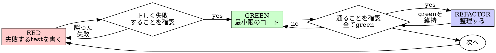

# テスト駆動開発(TDD)

## 概要

先にtestを書く。失敗するのを確認する。通る最小限のコードを書く。

**中心原則:** testが失敗するのを見ていなければ、そのtestが正しいものを検証しているかどうかは分からない。

**規則の文面に違反することは、規則の趣旨に違反することだ。**

## 使う場面

**常に使う:**

- 新機能
- バグ修正
- リファクタリング
- 振る舞いの変更

**例外(人間のパートナーに確認する):**

- 使い捨てのプロトタイプ
- 生成されたコード
- 設定ファイル

「今回だけTDDを省こう」と考えているなら、そこで止まる。それは言い訳だ。

## 鉄則

```
失敗するテストが先にない限り、本番コードを書かない
```

testより先にコードを書いたなら、削除して最初からやり直す。

**例外はない:**

- 「参考」として残さない
- testを書きながらコードを「調整」しない
- 見ない
- 削除とは削除することだ

testから新しく実装する。以上。

## Red-Green-Refactor



### RED - 失敗するテストを書く

起こるべきことを示す最小限のtestを1つ書く。

<Good>
```typescript
test('retries failed operations 3 times', async () => {
  let attempts = 0;
  const operation = () => {
    attempts++;
    if (attempts < 3) throw new Error('fail');
    return 'success';
  };

const result = await retryOperation(operation);

expect(result).toBe('success');
expect(attempts).toBe(3);
});

````
名前が明確で、実際の振る舞いを検証し、1つのことだけを扱う
</Good>

<Bad>
```typescript
test('retry works', async () => {
  const mock = jest.fn()
    .mockRejectedValueOnce(new Error())
    .mockRejectedValueOnce(new Error())
    .mockResolvedValueOnce('success');
  await retryOperation(mock);
  expect(mock).toHaveBeenCalledTimes(3);
});
````

名前が曖昧で、コードではなくmockを検証している
</Bad>

**要件:**

- 振る舞いは1つ
- 名前が明確
- 実際のコードを使う(避けられない場合を除きmockを使わない)

### RED の確認 - 失敗するのを見る

**必須。決して省略しない。**

```bash
npm test path/to/test.test.ts
```

確認すること:

- testが失敗する(エラーにならない)
- 失敗メッセージが想定どおりである
- 機能が未実装だから失敗している(typoが原因ではない)

**testが通った?** 既存の振る舞いを検証している。testを直す。

**testがエラーになった?** エラーを直し、正しく失敗するまで再実行する。

### GREEN - 最小限のコード

testを通す最も単純なコードを書く。

<Good>
```typescript
async function retryOperation<T>(fn: () => Promise<T>): Promise<T> {
  for (let i = 0; i < 3; i++) {
    try {
      return await fn();
    } catch (e) {
      if (i === 2) throw e;
    }
  }
  throw new Error('unreachable');
}
```
通るのに十分なだけ
</Good>

<Bad>
```typescript
async function retryOperation<T>(
  fn: () => Promise<T>,
  options?: {
    maxRetries?: number;
    backoff?: 'linear' | 'exponential';
    onRetry?: (attempt: number) => void;
  }
): Promise<T> {
  // YAGNI
}
```
過剰設計
</Bad>

機能の追加、他のコードのリファクタリング、testを超えた「改善」はしない。

### GREEN の確認 - 通るのを見る

**必須。**

```bash
npm test path/to/test.test.ts
```

確認すること:

- testが通る
- 他のtestも通ったままである
- 出力がきれいである(エラーも警告もない)

**testが失敗した?** testではなくコードを直す。

**他のtestが失敗した?** 今すぐ直す。

**「他のtest」とは、自分のファイルだけでなくprojectのスイート全体を指す。** 自分が書いたtestが
greenになっても、スイートがgreenになったとは限らない。変更を完了と呼ぶ前に、
タスクが1つのtestファイルしか挙げていなくても、projectのtestコマンド(素の`pytest`、
`npm test`、`cargo test`など、そのrepoが使うもの)を実行する。タスクに書かれた範囲は成果物の
範囲を区切るだけで、検証の範囲を区切るものではない。その実行で見つかった失敗は、
自分が原因でないものも含めて、名前を挙げて報告に載せる。流れていくのを見ていながら
言及しなかった赤いtestは、省略によって偽りになった報告だ。

### REFACTOR - 整理する

greenになった後だけ行う:

- 重複を除く
- 名前を改善する
- helperを抽出する

testをgreenに保つ。振る舞いを追加しない。

### 繰り返す

次の機能のために、次の失敗するtestを書く。

## 良いテスト

| 品質           | 良い                                           | 悪い                                                |
| -------------- | ---------------------------------------------- | --------------------------------------------------- |
| **最小限**     | 1つのことだけ。名前に「and」がある? 分割する。 | `test('validates email and domain and whitespace')` |
| **明確**       | 名前が振る舞いを説明している                   | `test('test1')`                                     |
| **意図を示す** | 望ましいAPIを示している                        | コードが何をすべきかが分かりにくい                  |

## よくある言い訳

| 言い訳                                                     | 現実                                                                                                                                                                                                                                                                                    |
| ---------------------------------------------------------- | --------------------------------------------------------------------------------------------------------------------------------------------------------------------------------------------------------------------------------------------------------------------------------------- |
| 「単純すぎてtestするまでもない」                           | 単純なコードも壊れる。testは30秒で書ける。                                                                                                                                                                                                                                              |
| 「後でtestを書く」                                         | 後から書いたtestはすぐに通る。それは何も証明しない。誤ったものを検証しているかもしれず、振る舞いではなく実装を検証しているかもしれず、忘れていたedge caseを見逃しているかもしれない。失敗するのを見ていないので、バグを捕捉できると証明したこともない。test-firstはその失敗を強制する。 |
| 「後からtestを書いても目的は同じ(儀式ではなく趣旨が大事)」 | 後から書くtestは「これは何をするのか」に答え、先に書くtestは「これは何をすべきか」に答える。後から書くtestは、すでに書いたコードに引きずられる。思い出したケースは検証するが、先に書いていれば見つけたはずのケースは検証しない。testが機能する証明のない網羅率にすぎない。              |
| 「すでに手動でtestした」                                   | 手動のtestは場当たり的だ。何を網羅したかの記録がなく、コードが変わったときに再実行する方法がなく、切迫すると簡単にケースを忘れる。「試したら動いた」は「網羅した」と同じではない。自動testは毎回同じ方法で実行される。                                                                  |
| 「X時間分を削除するのはもったいない」                      | サンクコストの誤謬だ。その時間はどちらにせよすでに使われている。本当の選択は、TDDで書き直す(信頼性が高い)か、残してtestを後付けする(信頼性が低く、バグが残りやすい)かだ。信頼できないコードを残すことこそが無駄だ。                                                                     |
| 「参考として残して、先にtestを書く」                       | 結局それを調整してしまう。それは後からtestを書くことだ。削除とは削除することだ。                                                                                                                                                                                                        |
| 「先に探索する必要がある」                                 | 構わない。探索の成果物は捨てて、TDDから始める。                                                                                                                                                                                                                                         |
| 「testが難しい = 設計が不明確」                            | testの声を聞く。testしにくいものは使いにくい。                                                                                                                                                                                                                                          |
| 「TDDは遅くなる」                                          | TDDこそ現実的な道だ。commit前にバグを捕捉し、リグレッションを防ぎ、恐れずにリファクタリングできる。「現実的」な近道は本番でのデバッグを意味し、速くなるどころか遅くなる。                                                                                                               |
| 「手動testのほうが速い」                                   | 手動ではedge caseを証明できない。変更のたびに再testすることになる。                                                                                                                                                                                                                     |
| 「既存コードにtestがない」                                 | それを改善しようとしている。既存コードにもtestを追加する。                                                                                                                                                                                                                              |

## 危険信号 - 止まって最初からやり直す

- testより先にコードを書いた
- 実装の後にtestを書いた
- testがすぐに通る
- testがなぜ失敗したか説明できない
- testを「後で」追加する
- 「今回だけ」と言い訳している
- 「すでに手動でtestした」
- 「後から書いても同じ目的を果たす」
- 「大事なのは儀式ではなく趣旨だ」
- 「参考として残す」または「既存コードを調整する」
- 「すでにX時間かけたので、削除はもったいない」
- 「TDDは教条的で、自分は現実的に進めている」
- 「今回は事情が違う。なぜなら...」

**これらはすべて同じ意味だ: コードを削除する。TDDで最初からやり直す。**

## 例: バグ修正

**バグ:** 空のemailが受理される

**RED**

```typescript
test("rejects empty email", async () => {
  const result = await submitForm({ email: "" });
  expect(result.error).toBe("Email required");
});
```

**RED の確認**

```bash
$ npm test
FAIL: expected 'Email required', got undefined
```

**GREEN**

```typescript
function submitForm(data: FormData) {
  if (!data.email?.trim()) {
    return { error: "Email required" };
  }
  // ...
}
```

**GREEN の確認**

```bash
$ npm test
PASS
```

**REFACTOR**
複数のフィールドに対応するため、必要ならvalidationを抽出する。

## 検証チェックリスト

作業を完了とする前に:

- [ ] 新しい関数・メソッドすべてにtestがある
- [ ] 実装する前に、各testが失敗するのを見た
- [ ] 各testが想定した理由(機能が未実装であり、typoではない)で失敗した
- [ ] 各testを通す最小限のコードを書いた
- [ ] すべてのtestが通る
- [ ] 出力がきれいである(エラーも警告もない)
- [ ] testが実際のコードを使っている(避けられない場合のみmockを使う)
- [ ] edge caseとエラーを網羅している

すべてにチェックを付けられない? TDDを省略している。最初からやり直す。

## 行き詰まったとき

| 問題                       | 解決策                                                           |
| -------------------------- | ---------------------------------------------------------------- |
| testの方法が分からない     | 理想のAPIを書く。先にassertionを書く。人間のパートナーに尋ねる。 |
| testが複雑すぎる           | 設計が複雑すぎる。interfaceを単純にする。                        |
| すべてをmockする必要がある | コードの結合が強すぎる。dependency injectionを使う。             |
| testのsetupが巨大          | helperを抽出する。それでも複雑なら、設計を単純にする。           |

## デバッグとの統合

バグを見つけた? それを再現する失敗するtestを書く。TDDのサイクルに従う。testが修正を証明し、リグレッションを防ぐ。

testなしにバグを直してはならない。

## 最終規則

```
本番コード → testが存在し、かつ先に失敗していた
そうでなければ → TDDではない
```

人間のパートナーの許可なく例外を設けてはならない。
